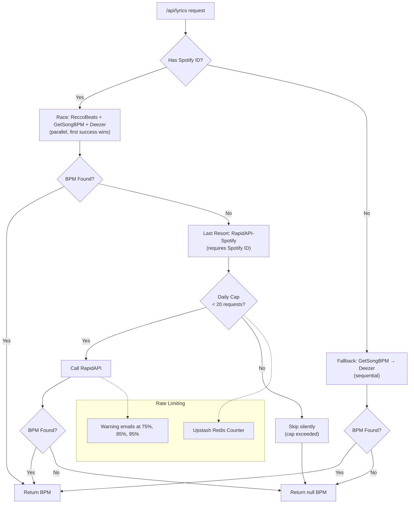

# ScrollTunes Implementation TODO

> Track progress by checking off items: `- [x]`

## Phase 0: Project Setup ✅

- [x] Initialize Next.js 15 project with App Router
- [x] Configure TypeScript (strict mode, path aliases)
- [x] Set up Biome for linting/formatting
- [x] Configure Tailwind CSS 4
- [x] Set up Vitest for testing
- [x] Create initial folder structure (`src/`, `app/`, etc.)
- [x] Add Motion (motion.dev) dependency
- [x] Add Tone.js dependency
- [x] Add Effect.ts dependency
- [x] Configure Vercel deployment
- [x] Create `.env.example` with required variables

## Phase 1: Core Infrastructure ✅

### Design Tokens
- [x] Create `src/theme.ts` with token exports
- [x] Create `src/animations.ts` with spring configs
- [x] Create `src/constants/index.ts` with app constants

### Audio System
- [x] Create `src/sounds/SoundSystem.ts` (singleton, owns AudioContext)
- [x] Implement lazy initialization pattern
- [x] Add mute/unmute functionality
- [x] Create basic UI feedback sounds
- [x] Add microphone analyser for VAD

### State Management (Effect.ts)
- [x] Create `src/core/` folder
- [x] Implement base store pattern with `useSyncExternalStore`
- [x] Create `src/core/LyricsPlayer.ts` with tagged events
- [x] Create `src/core/VoiceActivityStore.ts` with VAD logic
- [x] Export React hooks for state subscription

## Phase 2: Lyrics Display ✅

### Data Layer
- [x] Define `Lyrics` type (lines, timestamps, words)
- [x] Create `src/lib/lyrics-parser.ts` (parse LRC format)
- [x] Write tests for lyrics parser
- [x] Create mock lyrics data for development

### Components
- [x] Create `src/components/display/LyricsDisplay.tsx`
- [x] Create `src/components/display/LyricLine.tsx`
- [x] Implement smooth scrolling with Motion transforms
- [x] Add current line highlighting
- [x] Make responsive (mobile-first)

### Player Logic
- [x] Implement `LyricsPlayer` state machine (idle → playing → paused)
- [x] Add time-based line advancement
- [x] Implement click-to-seek on lyric lines
- [x] Add manual scroll override detection

## Phase 3: Voice Detection ✅

### VAD Implementation
- [x] Create `src/lib/voice-detection.ts` (pure math functions)
- [x] Implement RMS energy calculation
- [x] Add smoothing and hysteresis logic
- [x] Write tests for VAD logic

### Integration
- [x] Implement `VoiceActivityStore` with mic access
- [x] Create `src/hooks/useVoiceTrigger.ts`
- [x] Wire VAD to LyricsPlayer (voice start → play)
- [x] Add visual indicator for listening state
- [x] Handle permission denied gracefully

### Testing
- [ ] Test on mobile devices (iOS Safari, Android Chrome)
- [x] Verify VAD doesn't trigger on guitar/instruments (YAMNet classifier gate)
- [ ] Test with background noise

### Audio Classification (Instrument vs Voice) ✅
- [x] Implement YAMNet audio classifier via MediaPipe
- [x] Create dedicated AudioContext for classifier capture (bypasses Tone.js)
- [x] Add ring buffer for 1s audio at 16kHz in SoundSystem
- [x] Integrate classifier as gate before speech release
- [x] Add "Music without voice" rejection rule (guitar strumming)
- [x] Add Silero override for sustained high confidence (singing over guitar)
- [x] Reduce rejection cache to 500ms for faster recovery
- [x] Extract vadLog to shared module for cross-file logging
- [x] Suppress TensorFlow XNNPACK INFO message with warm-up classification

## Phase 4: Song Search & Lyrics API ✅

### LRCLIB Integration
- [x] Choose lyrics provider (lrclib.net - free, synced LRC)
- [x] Create `src/lib/lyrics-client.ts`
- [x] Implement lyrics fetch API route
- [x] Handle missing lyrics gracefully
- [x] Add lyrics attribution as required
- [x] Implement song search via LRCLIB API

### GetSongBPM Integration ✅
- [x] Create `src/lib/bpm/` module with provider abstraction
- [x] Implement GetSongBPM API client (`getsongbpm-client.ts`)
- [x] Add tagged error classes (BPMNotFoundError, BPMAPIError, BPMRateLimitError)
- [x] Implement server-side in-memory cache
- [x] Implement client-side localStorage cache utilities
- [x] Integrate BPM lookup into `/api/lyrics` route
- [x] Add required attribution (backlinks to getsongbpm.com)
- [x] Create shared `LyricsApiResponse` types
- [x] Add normalization for "feat.", remix suffixes, parentheticals
- [x] Write comprehensive tests (47 BPM tests)

### BPM Integration (Pending)
- [ ] Use BPM to auto-adjust scroll speed in LyricsPlayer
- [ ] Wire localStorage BPM cache on client (getCachedBpm/setCachedBpm)
- [ ] Add tests for localStorage BPM cache utilities

### BPM Providers ✅
- [x] Implement ReccoBeats provider (Spotify ID → audio features)
- [x] Implement GetSongBPM provider (title/artist search)
- [x] Implement Deezer provider (fallback)
- [x] Implement RapidAPI-Spotify provider (last resort, 20 req/day cap)
- [x] Add Upstash Redis rate limiting for RapidAPI cap
- [x] Add warning emails at 75%, 85%, 95% usage via Web3Forms
- [x] Integrate providers with Effect.ts fallback/race patterns

### BPM Fallback Sources (Future)
- [ ] Implement tap tempo as manual fallback
- [ ] Prototype strum/beat detection from microphone input

### UI
- [x] Create song search component
- [x] Create song selection/confirmation screen
- [x] Show loading states
- [x] Handle API errors

## Phase 5: Tempo & Controls ✅

### Tempo Adjustment
- [x] Add tempo slider component (`TempoControl.tsx`)
- [x] Implement scroll speed adjustment
- [x] Add preset buttons (Slower, Original, Faster)
- [x] Persist tempo preference per song (localStorage)

### Playback Controls
- [x] Create play/pause button
- [x] Add restart button
- [x] Implement progress indicator (`ProgressIndicator.tsx`)
- [x] Add keyboard shortcuts (`useKeyboardShortcuts.ts`)

## Phase 6: Mobile & Hands-Free ✅

### Responsive UI
- [x] Add wake lock (`useWakeLock` hook)
- [x] Implement auto-hide controls
- [x] Test all screens on mobile viewports (pending manual testing)
- [x] Ensure large touch targets

### Hands-Free (Basic)
- [x] Implement double-tap to pause/resume (`useDoubleTap`)
- [x] Add shake to restart (`useShakeDetection`, opt-in)
- [x] Create preferences store for gesture toggles (`PreferencesStore`)

### Pending
- [ ] Wire distraction-free mode preference to song page UI
- [ ] Manual mobile testing (iOS Safari, Android Chrome)

## Phase 7: Single-User Polish ✅

### Settings UI
- [x] Create `/settings` page
- [x] Add toggle for wake lock
- [x] Add toggle for double-tap pause
- [x] Add toggle for shake-to-restart
- [x] Add auto-hide timeout slider
- [x] Add distraction-free mode toggle

### UX Improvements
- [ ] Add onboarding/tutorial for first-time users
- [x] Improve error states (API failures, no lyrics found)
- [x] Add loading skeletons for search results
- [x] Add "no results" empty state with suggestions
- [x] Display lyrics attribution in UI (API returns it, shown in Attribution component)
- [ ] Skip lyrics fetch when `hasLyrics === false` (show error immediately)

### Permalinks & URLs
- [x] Implement permalink support (SEO-friendly canonical URLs)
- [x] Implement short URL redirects (/s/[id])
- [x] Add /api/lyrics/[id] endpoint for ID-based lookup
- [x] Create slug utilities (toSlug, makeCanonicalPath)

### Visual Polish
- [ ] Refine typography and spacing
- [ ] Add subtle animations for state transitions
- [x] Improve voice indicator feedback
- [x] Add haptic feedback on mobile (if supported)

### Testing & Validation
- [ ] Manual testing on iOS Safari
- [ ] Manual testing on Android Chrome
- [ ] Test VAD with various microphones
- [ ] Verify VAD doesn't trigger on guitar/instruments
- [ ] Test with background noise
- [ ] Performance audit (bundle size, FCP, LCP)

## Code Cleanup (Technical Debt)

- [ ] Remove dead SongConfirmation component
- [ ] Remove unused async wrappers from lyrics-client.ts
- [ ] Unify SearchResultTrack type (API and client)
- [ ] Fix /api/lyrics/[id] params typing (Promise<{id}> → {id})
- [ ] Add LyricsApiResponse type to route responses

## Phase 8: Song Management (Local)

### Recent Songs
- [x] Store recent songs in localStorage
- [x] Create recent songs list on home page
- [x] Cache lyrics and BPM data locally (7-day TTL)
- [x] Add "clear history" option


### Per-Song Settings
- [x] Persist tempo per song (via useTempoPreference)
- [ ] Add notes field per song (key, capo position, etc.)
- [ ] Store in localStorage keyed by song ID

---

## V2 Features (Future)

### Improved Search Accuracy ✅
- [x] Treat user input as imprecise - use Spotify search to get canonical metadata
- [x] Use Spotify's fuzzy matching to resolve typos, spelling variants (Colors/Colours)
- [x] Pass Spotify's exact title/artist to LRCLIB's `/api/search` endpoint
- [x] LRCLIB supports separate `track_name` and `artist_name` params for precise matching
- [x] Search top 8 Spotify results in parallel against LRCLIB
- [x] Deduplicate results by normalized track+artist
- [x] Fall back to LRCLIB keyword search (`q=`) if Spotify fails
- [x] Normalize display names using `@web-scrobbler/metadata-filter` (strips remaster labels, radio edit, feat., etc.)
- [x] Show normalized titles/artists/albums in all UI (search, recents, song page, modals)
- [x] Keep original names for storage, caching, and API lookups

### Search Flow Refactor ✅

**Implemented flow:**
```
User Query
  → Spotify Search (top 8 results)
  → Extract: artist, title, album, duration (normalized)
  → LRCLIB /api/get-cached (fast, local DB only)
  → Fallback: LRCLIB /api/get (may fetch external sources)
  → Return Spotify canonical data + LRCLIB ID + Spotify ID
  → If Spotify fails: fallback to LRCLIB /api/search
```

**Completed:**
- [x] Add `checkLyricsAvailability()` that calls LRCLIB get-cached → get
- [x] Spotify query: search top 8 results, use normalized metadata for LRCLIB
- [x] LRCLIB query: prefer `/api/get-cached` first (fast, no external fetch)
- [x] Fallback chain: Spotify → `/api/get-cached` → `/api/get` → LRCLIB search
- [x] Result metadata: use Spotify names as canonical (not LRCLIB)
- [x] Album: required in DB schema (NOT NULL with default "")
- [x] Stored data: Spotify canonical + LRCLIB ID + album art
- [x] Update `SearchResultTrack` type: `album` is required string

### Chords Integration (Experimental)
- [x] Research chord API options → Chose Songsterr API
- [x] Create `src/lib/chords/songsterr-client.ts` with Effect.ts patterns
- [x] Create `src/lib/chords/chord-parser.ts` for data extraction
- [x] Create `src/lib/chords/chord-matching.ts` for lyrics sync
- [x] Create chord overlay components (`InlineChord`, `ChordBadge`)
- [x] Add transpose controls (+/- semitones) with persistence
- [x] Create `ChordsStore` with useSyncExternalStore pattern
- [x] Add API routes `/api/chords/search` and `/api/chords/[songId]`
- [x] Gate feature behind experimental setting
- [x] Add chords toggle button to song action bar
- [ ] Implement ChordDiagram component (tap to see fingering)
- [ ] Implement capo indicator
- [ ] Add ChordLegend sidebar (tablet/desktop)

### User Accounts
- [ ] Set up database (Vercel Postgres or alternative)
- [ ] Implement authentication (OAuth or email)
- [ ] Create user profile page
- [ ] Sync favorites/history across devices
- [ ] Connect Spotify account for personalized search

### Karaoke Mode
- [ ] Create `src/components/display/KaraokeDisplay.tsx`
- [ ] Implement large text display (2-3 lines max)
- [ ] Add per-word highlighting (if timestamps available)
- [ ] Implement countdown before start
- [ ] Add color themes

### Jam Session (Multiplayer)
- [ ] Set up WebSocket infrastructure
- [ ] Create session creation flow
- [ ] Implement QR code generation
- [ ] Add guest join flow
- [ ] Build song queue UI
- [ ] Implement real-time sync
- [ ] Add host controls

### Voice Search ✅
- [x] **Tiered plan**: [docs/voice-search-webspeech-google-stt-plan.md](docs/voice-search-webspeech-google-stt-plan.md)
- [x] Phase 1: Backend transcription via Google STT V2 (latest_short model)
- [x] Phase 2: SpeechRecognitionStore + audio capture (MediaRecorder)
- [x] Phase 3: ~~Integrate with VoiceActivityStore for auto-stop~~ Use Web Speech native end-of-utterance detection
- [x] Phase 4: UI integration with SongSearch (mic button with pulsing animation)
- [x] Phase 5: Quota tracking, error handling, usage alerts
- [x] Phase 6: Tiered speech recognition (Web Speech API primary → Google STT fallback)
  - [x] Web Speech API as primary tier (fast, free, native end-of-utterance)
  - [x] Confidence-based fallback: Google STT only when transcript is low quality
  - [x] Confidence checks: min length (2 chars), garbage ratio (<30%)
  - [x] `tierUsed` state tracking (`"google_stt"` | `"webspeech"`)
  - [x] Quota API returns `webSpeechAvailable` flag
  - [x] Test page at `/test/voice-search`
- [x] Phase 7: Brave desktop detection + VAD-based end-of-utterance
  - [x] Detect Brave desktop via `navigator.brave.isBrave()` API
  - [x] Skip Web Speech on Brave desktop (blocks connections to Google speech servers)
  - [x] Mobile Brave excluded (uses native OS speech, works fine)
  - [x] VAD-based end-of-utterance for Google STT mode using VoiceActivityStore
  - [x] AND-gate disabled for voice search (only voice detection needed)
  - [x] 1.5s silence timer after voice stops (handles pauses between words)
  - [x] Brave detection section on test page at `/test/voice-search`
- [x] Phase 8: Streaming STT via WebSocket bridge (Brave desktop + no Web Speech)
  - [x] **Design doc**: [docs/voice-streaming-stt.md](docs/voice-streaming-stt.md)
  - [x] WebSocket bridge server (`stt-ws-bridge/`) deployed to Cloud Run
  - [x] Google Speech V2 streaming API integration
  - [x] HMAC-signed session tokens via `/api/stt-token`
  - [x] SttStreamClient with Effect.ts patterns (`src/lib/stt-stream-client.ts`)
  - [x] AudioWorklet for low-latency PCM capture (`public/pcm-worklet.js`)
  - [x] VAD-based end-of-utterance for streaming mode
  - [x] Real-time partial transcript display
  - [x] Automatic punctuation disabled for music search
  - [x] Stability guard (wait for transcript stability before finalizing)
  - [x] VAD parameter presets (fast search, noisy environment)
  - [ ] Multi-language wiring (pass alternativeLanguageCodes from preferences)
- [x] Phase 9: Private key handling & test page improvements
  - [x] Private key normalization: strips surrounding quotes, handles single-line PEM keys
  - [x] Test page (`/test/voice-search`) improvements:
    - [x] Google Cloud STT Direct Tester with VAD auto-stop toggle
    - [x] Web Speech API Direct Tester with Brave detection (disables when Brave detected)
    - [x] Streaming STT Direct Tester
- [ ] Use named recognizer instead of `_` to enable `audio_durations` metric for Google Cloud monitoring

### Advanced Features
- [x] Metronome mode (UI for existing `SoundSystem.playMetronomeTick`)
- [ ] Word-level detection (Smart Sync) - requires ML-based VAD
- [ ] Karaoke playback (instrumental tracks)
- [ ] Voice commands (beyond search)
- [ ] Foot pedal support
- [ ] Offline mode / setlist caching

### Code Quality
- [ ] Wrap client-side fetch calls in Effect for consistency
- [ ] Add Effect-based caching layer for LyricsPlayer
- [ ] Use Effect Schema or Zod for API response validation

---

## Phase 9: User Accounts

> **Spec:** [docs/user-accounts-spec.md](docs/user-accounts-spec.md)

### Infrastructure
- [x] Add Auth.js (NextAuth v5) with Drizzle adapter
- [x] Set up Vercel Postgres database
- [x] Configure Drizzle ORM with schema
- [x] Create database migrations (via drizzle-kit push)
- [x] Add Google OAuth provider
- [ ] Add Spotify OAuth provider (deferred until production HTTPS)
- [x] Create token encryption utilities

### Database Schema
- [x] Create `app_user_profiles` table
- [x] Create `user_song_items` table (history + favorites + play count)
- [x] Create `user_song_settings` table
- [x] Create `user_setlists` table
- [x] Create `user_setlist_songs` junction table
- [x] Create `user_spotify_tokens` table (encrypted)

### API Routes
- [x] `/api/auth/[...nextauth]` - Auth.js handlers
- [x] `/api/user/me` - Get user profile
- [x] `/api/user/history/sync` - Sync song history
- [x] `/api/user/history` GET - Fetch history
- [x] `/api/user/history` DELETE - Clear history
- [x] `/api/user/history/count` - Get history count (for skeleton)
- [x] `/api/user/favorites/sync` - Sync favorites
- [x] `/api/user/favorites/[songId]` DELETE - Remove favorite
- [ ] `/api/user/song-settings` GET/POST - Per-song settings
- [x] `/api/user/setlists` GET/POST - List/create setlists
- [x] `/api/user/setlists/[id]` GET/PATCH/DELETE - Setlist CRUD
- [x] `/api/user/setlists/[id]/songs` - Add/remove/reorder songs
- [x] `/api/user/export` - GDPR data export (JSON)
- [x] `/api/user/delete` - Account deletion

### Client Integration
- [x] Create `AccountStore` with useSyncExternalStore
- [x] Create `FavoritesStore` with useSyncExternalStore
- [x] Create `SetlistsStore` with useSyncExternalStore + localStorage caching
- [x] Implement localStorage → server merge on first login
- [x] Add ongoing sync for song plays and favorites
- [x] Optimized loading: fetch count first, show correct skeleton count
- [x] Add `useSetlistsContainingSong` hook for song membership check
- [ ] Handle offline mode gracefully

### UI Components
- [ ] Create feature comparison screen (Free vs Account) — A/B test
- [x] Create `/login` page with consent flow
- [ ] Redesign login page to be less dry (more visual, welcoming)
- [x] Fix user avatar size to match other header icons visually
- [x] Display attribution for fetched song info (lyrics/BPM source in info modal)
- [x] Add user avatar/sign-in button to header
- [x] Add "Account & Sync" section to Settings page
- [x] Create export data flow
- [x] Create delete account flow with confirmation
- [ ] Add "Sign in to sync" prompt (optional, non-intrusive)
- [x] Create setlists management UI (create, edit, delete) - /setlists page
- [x] Add "Add to setlist" action on song pages (moved to SongActionBar)
- [x] Add favorite button (heart) on song pages (moved to SongActionBar)
- [x] Create SongActionBar with favorite + setlist icons in content body
- [x] Show setlist membership as colored icons (toggle add/remove from modal)
- [x] Cache setlists in localStorage for instant display
- [x] Create setlist detail view (/setlists/[id]) with song list and remove
- [x] Add EditSetlistModal for editing name, description, color
- [x] Add edit button to SetlistCard with pencil icon on hover
- [x] Add delete confirmation modal for setlists
- [x] Show 2x2 album art collage on SetlistCard from song album covers
- [ ] Add drag-to-reorder songs in setlist detail view

### Legal Updates
- [x] Update Privacy Policy with "Accounts and Synced Data" section
- [x] Update Terms of Service with "Accounts" section
- [x] Add Cookie Policy section
- [x] Update About page "Privacy First" section

### Security & Compliance
- [ ] Implement rate limiting on user endpoints
- [x] Add Spotify token encryption at rest
- [x] GDPR: Verify complete data export
- [x] GDPR: Verify complete data deletion

---

## Share Modal Visual Editor (Future)

> Full WYSIWYG editor for lyrics share cards. See [docs/share-modal-editor.md](docs/share-modal-editor.md) for detailed plan.

- [ ] State model (`ShareEditorStore`) with element positions, sizes, visibility
- [ ] Drag-and-drop repositioning (`@dnd-kit/core`)
- [ ] Resize handles for elements
- [ ] Selection UI with delete/hide controls
- [ ] Grid overlay with snap-to-grid
- [ ] Symmetry guidelines with magnetic snapping
- [ ] Smart spacing detection and guides
- [ ] Element visibility toggles
- [ ] Undo/redo history
- [ ] Touch support (drag, pinch-to-resize)
- [ ] Export compatibility with absolute positioning

---

## V3 Features (Future)

### Spotify Integration
- [ ] Set up Spotify OAuth flow (client credentials)
- [ ] Create `src/lib/spotify-client.ts`
- [ ] Implement song search API route with Spotify
- [ ] Implement track metadata fetch (tempo, BPM)
- [ ] Store tokens securely (in-memory cache with auto-refresh)
- [ ] Merge Spotify search results with LRCLIB lyrics availability
- [ ] Add album art from Spotify to search results

---

## Phase 10: LRC Enhancement System ✅

> Word-level timing from Guitar Pro files for precise karaoke-style highlighting

### Database Schema
- [x] Create `songs` table (global song catalog with normalized artist/title)
- [x] Create `song_lrclib_ids` table (maps songs to LRCLIB IDs, 1:many)
- [x] Create `lrc_word_enhancements` table (stores word-level timing payload)
- [x] Add `hasEnhancement` flag to songs table

### Enhancement Payload Format
```typescript
interface EnhancementPayload {
  version: number
  algoVersion: number
  lines: Array<{
    idx: number  // line index in LRC
    words: Array<{
      idx: number   // word index in line
      start: number // offset from line start in ms
      dur: number   // duration in ms
    }>
  }>
}
```

### Admin Panel
- [x] Create `/admin/songs` page with search, filters, pagination
- [x] Show enhancement status (checkmark for enhanced songs)
- [x] Filter by: all, synced, enhanced, unenhanced
- [x] Create `/admin/enhance/[slug]` page (slug = LRCLIB ID)
- [x] Add "Remove Enhancement" action on songs list

### Guitar Pro Integration
- [x] Create `GpUploader` component for .gp file upload
- [x] Parse Guitar Pro files using `alphatab` library
- [x] Extract lyric syllables with tick-based timing
- [x] Convert ticks to milliseconds using tempo events
- [x] Join syllables into words (handle hyphenated continuations)

### Alignment Algorithm (`src/lib/gp/align-words.ts`)
- [x] Parse LRC content into lines with words
- [x] Match GP words to LRC words using normalized comparison
- [x] Handle split syllables (e.g., "con" + "trol" → "control")
- [x] Use sliding window (MAX_LOOKAHEAD=10) for fuzzy matching
- [x] Calculate word offsets relative to first GP word in line (not LRCLIB line start)
- [x] Generate coverage statistics (% of words matched)

### API Routes
- [x] `POST /api/admin/lrc/enhance` - Save enhancement payload
  - Upserts on conflict (sourceLrclibId + lrcHash)
  - Updates song's `hasEnhancement` flag
- [x] `DELETE /api/admin/lrc/enhance` - Remove enhancement
- [x] `GET /api/admin/lrc/[id]` - Fetch LRCLIB lyrics by ID
- [x] `GET /api/admin/songs` - List songs with filters

### Client Integration
- [x] Add `enhancement` field to `LyricsApiSuccessResponse` type
- [x] Add `enhancement` field to `CachedLyrics` type
- [x] Update `/api/lyrics/[id]` to fetch and return enhancement payload
- [x] Create `applyEnhancement()` function (`src/lib/enhancement.ts`)
- [x] Apply enhancement to lyrics on song page load
- [x] Bump lyrics cache version to invalidate old cached data

### Word-Level Display
- [x] Pass `elapsedInLine` to `LyricLine` component
- [x] Create `WordOverlay` component with time-synced animation
- [x] Calculate initial clip-path based on elapsed time (handles seek)
- [x] Three states: word not started, word in progress, word complete

### Enhanced LRC Preview
- [x] Show word-level timing in preview format: `[mm:ss.xx] <mm:ss.xx> word ...`
- [x] Copy to clipboard functionality
- [x] Display after alignment, before save

### Files
- `src/lib/gp/` - Guitar Pro parsing and alignment
  - `align-words.ts` - Word alignment algorithm
  - `build-words.ts` - Syllable → word joining
  - `timing.ts` - Tick to millisecond conversion
  - `types.ts` - Shared types
- `src/lib/enhancement.ts` - Apply enhancement to lyrics
- `src/components/admin/` - Admin UI components
  - `GpUploader.tsx` - File upload
  - `AlignmentPreview.tsx` - Word timing editor
- `src/app/admin/songs/page.tsx` - Songs catalog
- `src/app/admin/enhance/[slug]/page.tsx` - Enhancement workflow

---

## Current Focus

> Update this section with what you're currently working on

**Completed:** Phase 0, 1, 2, 3, 4, 5, 6, 7 (core), Phase 8 (Recent Songs), Phase 9 (mostly complete), Phase 10 (LRC Enhancement)

**Active:** Phase 9 remaining items:
- API: `/api/user/song-settings` GET/POST
- UI: Drag-to-reorder songs in setlist detail, feature comparison screen, login page redesign
- Infra: Rate limiting, Spotify OAuth (needs production HTTPS), offline mode

**Blocked:** Spotify OAuth requires production HTTPS

**Next:** Drag-to-reorder songs in setlist detail view

---

## Architecture Notes

### Voice Detection Flow
```
User clicks mic → SingingDetectionStore.startListening()
  → Silero VAD (via @ricky0123/vad-web) + Energy monitoring (AND-gate)
  → SoundSystem.getMicrophoneAnalyser() for energy + classifier capture
  → Silero onFrameProcessed: smoothed speech probability > 0.75?
    → Yes: Check YAMNet classifier gate (Music without voice? Instrument?)
      → Classifier ALLOW/DEFER: Release speech, trigger VoiceStart
      → Classifier REJECT: Block, but keep retrying (Silero override if sustained)
    → No: Continue waiting
  → VoiceStart event → lyricsPlayer.play()
  → LyricsPlayer starts animation loop, advances currentTime
  → useCurrentLineIndex() updates → LyricsDisplay scrolls
```

### Permalink Flow
```
Search → SongSearch.handleTrackClick()
  → extractLrclibId(track.id) → makeCanonicalPath()
  → router.push('/song/[artistSlug]/[trackSlug]-[id]')
  → SongPage parses ID → fetches /api/lyrics/[id]
  → Loads into LyricsPlayer → renders LyricsDisplay

Short URL: /s/[id]
  → Server fetches /api/lyrics/[id]
  → Builds canonical path → 308 redirect
```

### Libraries
| Purpose | Library | Notes |
|---------|---------|-------|
| Audio Context | Tone.js | Single AudioContext owner (+ dedicated context for classifier) |
| VAD (Primary) | @ricky0123/vad-web | Silero VAD model, speech probability |
| VAD (Energy) | Custom RMS | Energy-based AND-gate, burst detection |
| Audio Classifier | MediaPipe YAMNet | Instrument vs voice discrimination |
| Animation | Motion | Spring-based, GPU-accelerated |
| State | Effect.ts | Tagged events, type-safe |
| Lyrics Source | LRCLIB | Free, synced LRC format |
| Song Search | LRCLIB | Direct search by artist/title |
| BPM Data | ReccoBeats | Primary, uses Spotify ID, music-specific |
| BPM Fallback | GetSongBPM | API key required, backlink mandatory |
| BPM Fallback | Deezer | No auth, less accurate |
| BPM Last Resort | RapidAPI-Spotify | 20 req/day cap, Upstash Redis rate limit |
| Rate Limiting | Upstash Redis | Daily counter for RapidAPI cap |
| Slug Utilities | Custom | toSlug, makeCanonicalPath for SEO URLs |

### BPM Integration



**BPM Provider Priority:**
1. **ReccoBeats** - Uses Spotify ID, music-specific data, fastest
2. **GetSongBPM** - Requires API key, 3000 req/hour
3. **Deezer** - No auth required, less accurate
4. **RapidAPI-Spotify** - Last resort, 20 req/day cap, uses Upstash Redis

**Rate Limits:**
- GetSongBPM: 3000 req/hour (1.2s intervals)
- RapidAPI-Spotify: 20 req/day (hard cap via Upstash Redis)

**Attribution:** Required backlinks shown in playback controls

**API Keys:**
- `GETSONGBPM_API_KEY` - https://getsongbpm.com/api
- `RAPIDAPI_KEY` - https://rapidapi.com/music-metrics-music-metrics-default/api/spotify-audio-features-track-analysis
- `KV_REST_API_URL` + `KV_REST_API_TOKEN` - Upstash Redis for rate limiting

### Demo Page
Access `/demo` to test voice detection with mock lyrics without needing Spotify/LRCLIB integration.
