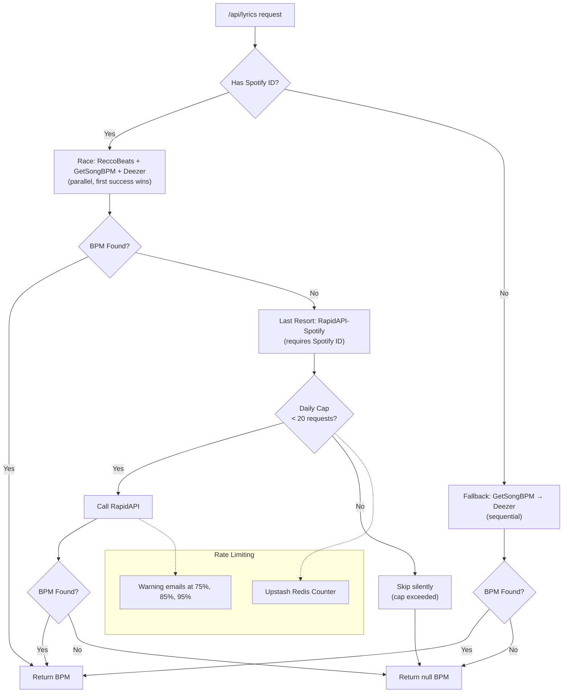

# ScrollTunes - Architecture Document

> Reference architecture based on [kitlangton/visual-effect](https://github.com/kitlangton/visual-effect)

## Overview

ScrollTunes is a web application for live musicians that displays synchronized scrolling lyrics with voice-triggered playback. Built with modern web technologies and designed for responsive, hands-free operation.

**In this house, we use bun.** All package management and script execution should use `bun` commands, not `npm` or `node`.

## Tech Stack

| Layer | Technology | Purpose |
|-------|------------|---------|
| **Frontend** | React 19 | UI components with hooks |
| **Framework** | Next.js 15 (App Router) | SSR, routing, API routes, code splitting |
| **Animation** | Motion (motion.dev) | Smooth spring animations, hardware-accelerated |
| **Styling** | Tailwind CSS 4 | Utility-first, responsive design |
| **Audio** | Tone.js + Web Audio API | Sound synthesis, audio analysis, VAD |
| **Hosting** | Vercel | Zero-config deployment, edge functions |
| **Package Manager** | bun | Fast installs and script execution |
| **Linting/Formatting** | Biome | Single tool replacing ESLint + Prettier |
| **Testing** | Vitest + jsdom | Fast unit testing with DOM environment |
| **Types** | TypeScript (strict) | Full type safety |
| **Database** | TBD | User profiles, session data |

## Project Structure

```
scrolltunes/
├── app/                          # Next.js App Router
│   ├── layout.tsx                # Root layout with metadata
│   ├── page.tsx                  # Home page (search only)
│   ├── globals.css               # Global styles + Tailwind
│   ├── s/[id]/
│   │   └── page.tsx              # Short URL redirect
│   ├── song/[artistSlug]/[trackSlugWithId]/
│   │   └── page.tsx              # Canonical lyrics player page
│   ├── settings/
│   │   └── page.tsx              # Settings page
│   └── api/                      # API routes
│       ├── search/route.ts       # LRCLIB song search
│       ├── lyrics/
│       │   ├── route.ts          # Lyrics by track/artist (legacy)
│       │   └── [id]/route.ts     # Lyrics by LRCLIB ID
│       └── session/route.ts
│
├── src/
│   ├── components/               # React components (by domain)
│   │   ├── display/              # Main display logic
│   │   │   ├── LyricsDisplay.tsx
│   │   │   ├── KaraokeDisplay.tsx
│   │   │   └── ScrollingLyrics.tsx
│   │   ├── audio/                # Audio-related components
│   │   │   ├── VoiceDetector.tsx
│   │   │   ├── Metronome.tsx
│   │   │   └── TempoControl.tsx
│   │   ├── chords/               # Guitar/chord components
│   │   │   ├── ChordDiagram.tsx
│   │   │   ├── ChordLegend.tsx
│   │   │   └── InlineChord.tsx
│   │   ├── feedback/             # User feedback (toasts, alerts)
│   │   │   └── NotificationBubble.tsx
│   │   ├── layout/               # Layout and navigation
│   │   │   ├── NavigationSidebar.tsx
│   │   │   ├── PageHeader.tsx
│   │   │   └── MobileNav.tsx
│   │   ├── search/               # Search and recent songs
│   │   │   └── RecentSongs.tsx   # Recent songs list for home page
│   │   ├── session/              # Jam session components
│   │   │   ├── QRCode.tsx
│   │   │   ├── SongQueue.tsx
│   │   │   └── GuestList.tsx
│   │   ├── ui/                   # Reusable UI primitives
│   │   │   ├── Button.tsx
│   │   │   ├── Slider.tsx
│   │   │   ├── Modal.tsx
│   │   │   ├── SegmentedControl.tsx
│   │   │   ├── VolumeToggle.tsx
│   │   │   └── index.ts          # Barrel export
│   │   ├── CodeBlock.tsx         # Top-level shared components
│   │   ├── Timer.tsx
│   │   └── index.ts
│   │
│   ├── hooks/                    # Custom React hooks
│   │   ├── useVoiceDetection.ts  # VAD hook
│   │   ├── useLyricsSync.ts      # Lyrics timing hook
│   │   ├── useAudioAnalysis.ts   # Web Audio analysis
│   │   ├── useWakeLock.ts        # Screen wake lock
│   │   ├── useHandsFree.ts       # Voice commands hook
│   │   ├── useStateTransition.ts # State change tracking
│   │   └── useOptionKey.ts       # Keyboard detection
│   │
│   ├── lib/                      # Core library code
│   │   ├── lyrics-parser.ts      # LRC/timestamp parsing
│   │   ├── lyrics-client.ts      # LRCLIB API wrapper (Effect.ts)
│   │   ├── lyrics-cache.ts       # localStorage lyrics caching (7-day TTL)
│   │   ├── recent-songs-types.ts # Types for recent songs feature
│   │   ├── slug.ts               # URL slug utilities
│   │   ├── bpm/                  # BPM provider abstraction
│   │   │   ├── index.ts          # Exports all providers
│   │   │   ├── bpm-types.ts      # Query/result types
│   │   │   ├── bpm-errors.ts     # Tagged error classes
│   │   │   ├── bpm-provider.ts   # Interface + fallback/race functions
│   │   │   ├── bpm-cache.ts      # In-memory caching wrapper
│   │   │   ├── reccobeats-client.ts     # ReccoBeats provider (Spotify ID)
│   │   │   ├── getsongbpm-client.ts     # GetSongBPM provider
│   │   │   ├── deezer-bpm-client.ts     # Deezer provider
│   │   │   └── rapidapi-spotify-client.ts # RapidAPI last resort (rate limited)
│   │   └── ...
│   │
│   ├── sounds/                   # Audio system (Tone.js)
│   │   ├── SoundSystem.ts        # Centralized sound manager
│   │   ├── metronome.ts          # Metronome sounds
│   │   └── notifications.ts      # UI feedback sounds
│   │
│   ├── constants/                # App constants
│   │   ├── colors.ts             # Color tokens
│   │   └── dimensions.ts         # Sizing/spacing values
│   │
│   ├── shared/                   # Shared utilities
│   │   └── idUtils.ts            # ID generation helpers
│   │
│   ├── animations.ts             # Centralized animation config
│   ├── theme.ts                  # Design tokens
│   └── AppContent.tsx            # Main app component
│
├── public/                       # Static assets
│   └── sounds/                   # Audio files (if any)
│
├── scripts/                      # Build/dev scripts
│
├── docs/                         # Documentation
│   ├── design.md
│   └── architecture.md
│
├── biome.json                    # Linting/formatting config
├── tailwind.config.js
├── tsconfig.json
├── next.config.js
├── vercel.json
├── vitest.config.ts
└── package.json
```

## Configuration Files

### TypeScript (tsconfig.json)

Strict configuration matching visual-effect:

```json
{
  "compilerOptions": {
    "target": "ES2022",
    "lib": ["dom", "dom.iterable", "esnext"],
    "strict": true,
    "exactOptionalPropertyTypes": true,
    "noUnusedLocals": true,
    "noImplicitOverride": true,
    "noFallthroughCasesInSwitch": true,
    "noUncheckedIndexedAccess": true,
    "noEmit": true,
    "incremental": true,
    "module": "esnext",
    "esModuleInterop": true,
    "moduleResolution": "node",
    "resolveJsonModule": true,
    "isolatedModules": true,
    "jsx": "preserve",
    "noErrorTruncation": true,
    "plugins": [{ "name": "next" }],
    "baseUrl": ".",
    "paths": {
      "@/*": ["src/*"]
    }
  }
}
```

### Biome (biome.json)

```json
{
  "$schema": "https://biomejs.dev/schemas/2.2.5/schema.json",
  "assist": { "actions": { "source": { "organizeImports": "on" } } },
  "linter": {
    "enabled": true,
    "rules": {
      "recommended": true,
      "correctness": { "useExhaustiveDependencies": "off" },
      "suspicious": { "noArrayIndexKey": "off", "noExplicitAny": "warn" },
      "style": { "noNonNullAssertion": "warn", "useNodejsImportProtocol": "error" },
      "complexity": { "useLiteralKeys": "error" },
      "a11y": {
        "noStaticElementInteractions": "off",
        "noSvgWithoutTitle": "off",
        "useKeyWithClickEvents": "off"
      }
    }
  },
  "formatter": {
    "enabled": true,
    "indentStyle": "space",
    "indentWidth": 2,
    "lineEnding": "lf",
    "lineWidth": 100
  },
  "javascript": {
    "formatter": {
      "semicolons": "asNeeded",
      "quoteStyle": "double",
      "jsxQuoteStyle": "double",
      "trailingCommas": "all",
      "arrowParentheses": "asNeeded"
    }
  }
}
```

### Vitest (vitest.config.ts)

```typescript
import { defineConfig } from "vitest/config"

export default defineConfig({
  test: {
    environment: "jsdom",
    globals: true,
  },
})
```

## Design Patterns

### 1. Component Architecture

Components organized by domain, not type:

```
components/
├── display/      # What the user sees (lyrics, karaoke view)
├── audio/        # Audio input/output (detection, metronome)
├── chords/       # Guitar-specific (diagrams, inline chords)
├── feedback/     # User feedback (notifications, alerts)
├── layout/       # App shell (header, nav, sidebar)
├── session/      # Multiplayer/social (queue, guests)
└── ui/           # Primitives (buttons, sliders, modals)
```

Top-level shared components (used across domains) live alongside folders.

### 2. Effect-First Architecture

**All domain logic MUST use Effect.ts patterns.** This is a core architectural requirement.

#### Why Effect-First?

- Type-safe error handling with tagged error classes
- Composable async operations
- Explicit dependency tracking
- Testable and mockable
- Consistent patterns across the codebase

#### Tagged Error Classes

All errors MUST be defined as `Data.TaggedClass`:

```typescript
import { Data } from "effect"

// ✅ Correct: Tagged error classes
export class LyricsNotFoundError extends Data.TaggedClass("LyricsNotFoundError")<{
  readonly trackName: string
  readonly artistName: string
}> {}

export class LyricsAPIError extends Data.TaggedClass("LyricsAPIError")<{
  readonly status: number
  readonly message: string
}> {}

export type LyricsError = LyricsNotFoundError | LyricsAPIError
```

#### Domain Functions Return Effects

All domain/library functions MUST return `Effect.Effect<T, E>`:

```typescript
import { Effect } from "effect"

// ✅ Correct: Returns Effect with typed error
export const getLyrics = (
  trackName: string,
  artistName: string,
): Effect.Effect<Lyrics, LyricsError> => {
  return Effect.gen(function* () {
    const response = yield* Effect.tryPromise({
      try: () => fetch(`${API_URL}?track=${trackName}`),
      catch: () => new LyricsAPIError({ status: 0, message: "Network error" }),
    })
    
    if (response.status === 404) {
      return yield* Effect.fail(new LyricsNotFoundError({ trackName, artistName }))
    }
    
    // ... rest of implementation
  })
}

// ❌ Wrong: Returns Promise directly
export async function getLyrics(trackName: string): Promise<Lyrics> {
  // Don't do this in domain code
}
```

#### Async Wrappers at Boundaries

Provide async wrappers for use at system boundaries (API routes, React event handlers):

```typescript
// Effect-based function (primary)
export const getLyrics = (track: string, artist: string): Effect.Effect<Lyrics, LyricsError> => ...

// Async wrapper for boundaries
export async function fetchLyrics(track: string, artist: string): Promise<Lyrics> {
  return Effect.runPromise(getLyrics(track, artist))
}
```

#### API Routes Use Effect Properly

API routes MUST use `Effect.runPromiseExit()` for proper error handling:

```typescript
import { Effect } from "effect"

export async function GET(request: NextRequest) {
  const effect = getLyrics(track, artist)
  const result = await Effect.runPromiseExit(effect)
  
  if (result._tag === "Failure") {
    const error = result.cause
    if (error._tag === "Fail") {
      if (error.error instanceof LyricsNotFoundError) {
        return NextResponse.json({ error: "Not found" }, { status: 404 })
      }
    }
    return NextResponse.json({ error: "Server error" }, { status: 500 })
  }
  
  return NextResponse.json({ data: result.value })
}
```

#### Core Store Events

Core stores use Effect-based event dispatch with tagged events:

```typescript
import { Data, Effect } from "effect"

// Tagged events
export class Play extends Data.TaggedClass("Play")<object> {}
export class Pause extends Data.TaggedClass("Pause")<object> {}
export class Seek extends Data.TaggedClass("Seek")<{ readonly time: number }> {}

export type PlayerEvent = Play | Pause | Seek

class LyricsPlayer {
  readonly dispatch = (event: PlayerEvent): Effect.Effect<void> => {
    return Effect.sync(() => {
      switch (event._tag) {
        case "Play":
          this.handlePlay()
          break
        case "Pause":
          this.handlePause()
          break
        case "Seek":
          this.handleSeek(event.time)
          break
      }
    })
  }
  
  // Convenience methods wrap dispatch
  play(): void {
    Effect.runSync(this.dispatch(new Play({})))
  }
}
```

### 3. State Management

**No external state management library** — each component/hook manages its own state:

```typescript
// Each domain object manages its own state internally
class LyricsPlayer {
  private listeners = new Set<() => void>()
  state: PlayerState = { _tag: "Idle" }

  subscribe(listener: () => void) {
    this.listeners.add(listener)
    return () => this.listeners.delete(listener)
  }

  private notify() {
    for (const listener of this.listeners) {
      listener()
    }
  }
}

// React components subscribe via useSyncExternalStore
function usePlayerState(): PlayerState {
  return useSyncExternalStore(
    lyricsPlayer.subscribe,
    lyricsPlayer.getSnapshot,
    lyricsPlayer.getSnapshot, // SSR fallback
  )
}
```

Key principles:
- Each core class manages its own state
- React components subscribe via `useSyncExternalStore`
- Lightweight hooks handle UI-specific state
- No global state for playback/detection
- State persists across component re-renders
- **Only notify on semantic state changes** (e.g., line index changes, not every frame)

### 4. Animation System

Centralized animation config using Motion (Framer Motion successor):

```typescript
// src/animations.ts
export const defaultSpring = {
  type: "spring" as const,
  mass: 1,
  stiffness: 200,
  damping: 2 * Math.sqrt(200), // ≈ 28.28 (critical damping)
  bounce: 0,
}

export const springs = {
  default: { type: "spring", stiffness: 180, damping: 25, mass: 0.8 },
  bouncy: { type: "spring", bounce: 0.3, visualDuration: 0.5 },
  lyricHighlight: { type: "spring", stiffness: 260, damping: 18 },
}

export const timing = {
  fadeIn: { duration: 0.2 },
  scroll: { duration: 0.3, ease: [0.4, 0, 0.6, 1] },
}

export const colors = {
  highlight: "rgba(100, 200, 255, 0.3)",
  active: "rgba(255, 255, 255, 0.9)",
}
```

Usage:
- Spring animations for natural movement
- Hardware-accelerated transforms
- Different animations for different state transitions
- All tokens centralized in `animations.ts`

### 5. Sound System

Centralized audio using Tone.js singleton pattern:

```typescript
// src/sounds/SoundSystem.ts
class SoundSystem {
  private synthMetronome: Tone.PolySynth | null = null
  private initialized = false
  private muted = false

  private async ready(): Promise<boolean> {
    if (this.muted) return false
    await this.initialize()
    return true
  }

  private async initialize(): Promise<void> {
    if (this.initialized) return
    await Tone.start()
    
    this.synthMetronome = new Tone.PolySynth(Tone.Synth, {
      oscillator: { type: "triangle" },
      envelope: { attack: 0.001, decay: 0.1, sustain: 0, release: 0.1 },
    }).toDestination()
    
    this.initialized = true
  }

  async playTick(accent: boolean) {
    if (!(await this.ready())) return
    const note = accent ? "C5" : "G4"
    this.synthMetronome?.triggerAttackRelease(note, "32n")
  }

  setMuted(muted: boolean) { this.muted = muted }
}

export const soundSystem = new SoundSystem()
```

Key principles:
- Singleton instance for shared state
- Lazy initialization (await `Tone.start()` on first use)
- Mute flag gates all playback
- Distinct sounds for different events
- User-friendly mute control

### 6. Theme Tokens

Minimal design tokens:

```typescript
// src/theme.ts
export const theme = {
  colors: {
    textPrimary: "#ffffff",
    textSecondary: "#a3a3a3",
    textMuted: "#525252",
  },
  spacing: {
    sm: 8,
  },
  radius: {
    md: 8,
  },
  shadow: {
    sm: "0 2px 4px rgba(0,0,0,0.4)",
  },
}
```

### 7. Custom Hooks Pattern

```typescript
// src/hooks/useVoiceDetection.ts
export interface UseVoiceDetectionOptions {
  threshold?: number
  onVoiceStart?: () => void
  deps?: DependencyList
}

export function useVoiceDetection(options: UseVoiceDetectionOptions = {}) {
  const { threshold = 0.5, onVoiceStart, deps = [] } = options
  
  const [isDetecting, setIsDetecting] = useState(false)
  const [confidence, setConfidence] = useState(0)
  
  // ... implementation
  
  return { isDetecting, confidence, start, stop }
}
```

### 8. Responsive Design

Mobile-first with Tailwind utilities:

```tsx
<div className="
  text-2xl md:text-4xl lg:text-5xl
  px-4 md:px-8
  flex flex-col md:flex-row
">
```

Key principles:
- Flex containers wrap naturally on small screens
- Sidebar collapses on narrow viewports
- Typography scales using relative units
- Large touch targets for finger taps

## API Design

### Internal API Routes

```
/api/search              # Search songs via LRCLIB
/api/lyrics              # Fetch lyrics by track/artist (legacy)
/api/lyrics/[id]         # Fetch lyrics by LRCLIB ID
/api/session/create      # Create jam session
/api/session/[id]/join   # Join session
/api/session/[id]/queue  # Manage song queue
```

### Permalink URL Structure

Canonical URLs embed the LRCLIB ID for stability while maintaining SEO-friendly slugs:

| Pattern | Example | Purpose |
|---------|---------|---------|
| `/song/[artistSlug]/[trackSlug]-[id]` | `/song/queen/bohemian-rhapsody-12345` | Canonical lyrics page |
| `/s/[id]` | `/s/12345` | Short URL (308 redirects to canonical) |

Slug generation uses `normalizeTrackKey` for semantic normalization (removes "feat.", parentheticals) 
and `toSlug` for URL-safe encoding (lowercase, accents removed, hyphens).

### External Services

| Service | Purpose | Auth | Status |
|---------|---------|------|--------|
| LRCLIB | Song search, synced lyrics | None (public API) | Current |
| Spotify | Enhanced metadata, tempo, popularity | OAuth 2.0 | Future |
| Ultimate Guitar | Chord charts | TBD | Future |

## Development Workflow

### Commands

```bash
bun install          # Install dependencies
bun run dev          # Start dev server
bun run build        # Production build
bun run typecheck    # TypeScript check
bun run lint         # Biome lint
bun run format       # Biome format
bun run test         # Run Vitest tests
bun run check        # lint + typecheck + test (pre-commit)
```

### Package.json Scripts

```json
{
  "scripts": {
    "dev": "next dev --turbopack",
    "build": "next build",
    "start": "next start",
    "lint": "biome lint .",
    "format": "biome format --write .",
    "typecheck": "tsc --noEmit",
    "test": "vitest run",
    "check": "bun run lint && bun run typecheck && bun run test"
  }
}
```

## Best Practices

1. **Always memoize expensive computations** — Prevents recreation on every render
2. **Use `useSyncExternalStore`** — For subscribing to external state
3. **Keep core classes pure** — Side effects only where necessary
4. **Test on mobile** — Primary use case is phone on lap/music stand
5. **Follow the pattern** — Consistency makes the codebase maintainable
6. **Use proper accessibility** — ARIA labels, focus states, keyboard controls
7. **Optimize bundle size** — Lazy load routes, code split heavy components
8. **Path aliases** — Use `@/` for src imports

## Copy Style Guide

### Text and Descriptions

**Descriptions**: Use imperative mood, no ending punctuation
- ✅ "Detect voice and sync lyrics"
- ✅ "Display scrolling lyrics with chord diagrams"
- ❌ "Detects voice and syncs lyrics."
- ❌ "This displays scrolling lyrics"

**UI Text**: Sentence case for buttons/labels, action-oriented

**Error Messages**: Start with context, be specific, provide next steps

**Code Comments**: Present tense, focus on "why" not "what"

## Deployment

### Vercel Configuration

```json
{
  "framework": "nextjs",
  "regions": ["iad1"]
}
```

- Automatic deployments on push to `main`
- Preview deployments for PRs
- Edge functions for API routes
- Environment variables via Vercel dashboard

## Database / Storage (TBD)

Options under consideration:

| Option | Pros | Cons |
|--------|------|------|
| **Vercel Postgres** | Integrated, serverless | Cost at scale |
| **PlanetScale** | MySQL, branching, generous free tier | External service |
| **Supabase** | Postgres + auth + realtime | More complex |
| **Upstash Redis** | Session storage, rate limiting | Not relational |

Likely: **Vercel Postgres** for user data + **Upstash Redis** for sessions/cache.

## BPM Provider System

The BPM lookup system uses multiple providers with fallback and racing strategies, implemented using Effect.ts for composable async error handling.

### Provider Priority



### Providers

| Provider | Auth | Rate Limit | Notes |
|----------|------|------------|-------|
| **ReccoBeats** | None | None | Requires Spotify ID, most accurate |
| **GetSongBPM** | API Key | 3000/hour | Title/artist search |
| **Deezer** | None | None | Less accurate, fallback |
| **RapidAPI-Spotify** | API Key | 20/day | Last resort, Upstash rate limit |

### Effect.ts Patterns

All providers implement `BPMProvider` interface:

```typescript
interface BPMProvider {
  readonly name: string
  getBpm(query: BPMTrackQuery): Effect.Effect<BPMResult, BPMError>
}
```

Error types use `Data.TaggedError` for type-safe error handling:
- `BPMNotFoundError` - Triggers fallback to next provider
- `BPMAPIError` - Bubbles up immediately (no fallback)
- `BPMRateLimitError` - Bubbles up immediately

Composition functions:
- `getBpmWithFallback(providers, query)` - Sequential fallback on `BPMNotFoundError`
- `getBpmRace(providers, query)` - Parallel race, first success wins

### RapidAPI Rate Limiting

Uses Upstash Redis to enforce daily cap:
- Key: `rapidapi:usage:YYYY-MM-DD`
- TTL: 48 hours
- Cap: 20 requests/day
- Warnings: Email via Web3Forms at 75%, 85%, 95%
- Exceeded: Silently returns `BPMNotFoundError` (no charge)
