# Guitar Chords Integration Spec

> **Status**: Partially Implemented (Experimental)  
> **Priority**: High (v1.0 feature per design.md)  
> **Data Source**: Songsterr API + Scales-Chords API

## Overview

Display guitar chord progressions alongside scrolling lyrics, synchronized to the song timeline. Chords appear above corresponding lyric lines with optional fingering diagrams.

## Implementation Status

### ✅ Completed
- **Phase 1: Songsterr API Client** — `src/lib/chords/songsterr-client.ts` with Effect.ts patterns
- **Phase 2: Chord Data Parsing** — Extracts chord data from Songsterr's HTML state JSON
- **Phase 3: Chord/Lyrics Sync** — `matchChordsToLyrics` function for fuzzy text matching
- **Phase 4: UI Components (partial)**
  - `InlineChord.tsx` — Chord badges displayed above lyrics
  - `ChordBadge.tsx` — Individual chord name display
  - `TransposeControl.tsx` — +/- semitone controls
- **Phase 5: Transpose** — Full transposition with localStorage persistence
- **ChordsStore** — State management with useSyncExternalStore pattern
- **API Routes** — `/api/chords/search` and `/api/chords/[songId]`
- **Experimental Feature Flag** — Chords gated behind Settings → Experimental → Enable chords
- **Caching** — 7-day localStorage cache for chord data

### 🔲 Pending
- **ChordDiagram component** — Tap chord to see fingering (bottom sheet on mobile)
- **Capo indicator** — Display capo position when specified in Songsterr data
- **ChordLegend sidebar** — Show all chords used in song (tablet/desktop only)
- **Scales-Chords API integration** — For chord diagram images

## Integration Architecture

```mermaid
flowchart TD
    A["Song loaded (LRCLIB lyrics)"] --> B["Search Songsterr for matching song"]
    B --> C{Tab found?}
    C -->|Yes| D["Fetch tab data (.gp format)"]
    C -->|No| E["No chords available"]
    D --> F["Parse chord data + timing"]
    F --> G["Convert beat-based timing → ms using BPM"]
    G --> H["Merge chords with lyrics timeline"]
    H --> I["Display chords above lyric lines"]
    
    subgraph Display Layer
        I --> J["InlineChord component (chord name)"]
        I --> K["ChordDiagram sidebar (fingering)"]
        I --> L["Transpose controls (+/- semitones)"]
    end
```



## Data Flow

### Current System
- **Lyrics**: LRCLIB provides `[MM:SS.MS]` timestamps (millisecond precision)
- **BPM**: Our provider system (ReccoBeats → GetSongBPM → Deezer → RapidAPI)
- **Scrolling**: LyricsPlayer manages timeline, currentTime, scroll position

### Chord Integration
- **Chord Data**: Songsterr provides chords positioned inline with lyrics text (no timing)
- **Timing**: Match Songsterr lyrics text → LRCLIB lyrics via fuzzy matching
- **Display**: Chords inherit timestamp from matched LRCLIB line

## Songsterr API (Discovered)

> **Note**: These endpoints were discovered through exploration. They are not officially documented.

### Endpoints

| Endpoint | Method | Returns |
|----------|--------|---------|
| `/api/songs?pattern={query}` | GET | Search results array with `songId`, `hasChords`, `tracks` |
| `/api/song/{songId}` | GET | Song metadata (same as search item) |
| `/api/chords/{songId}` | GET | Chord metadata: `{ songId, chordpro: "hash", hasPlayer }` |
| `/a/wsa/{slug}-chords-s{songId}` | GET | **Full chord data** embedded in `<script id="state">` JSON |

### Search Response Example

```json
{
  "songId": 447,
  "artistId": 18,
  "artist": "The Eagles",
  "title": "Hotel California",
  "hasChords": true,
  "hasPlayer": true,
  "tracks": [
    {
      "instrumentId": 25,
      "instrument": "Acoustic Guitar (steel)",
      "name": "Glen Frey - 12 String Guitar",
      "tuning": [64, 59, 67, 62, 57, 52],
      "difficulty": 2,
      "hash": "guitar_cAoIoJ7p"
    }
  ],
  "defaultTrack": 3,
  "popularTrack": 3
}
```

### Chord Data Structure (from HTML state)

The chords page embeds full chord data in `<script id="state" type="application/json">`.
Key path: `state.chordpro.current[]`

```typescript
// Parsed ChordPro format
type ChordProDocument = ChordProEntry[]

type ChordProEntry = 
  | { type: "capo"; text: string }          // e.g., "2"
  | { type: "tuning"; text: string }        // e.g., "Standard (EADGBE)"
  | { type: "line"; line: ChordProElement[]; blocks: ChordProElement[][] }

type ChordProElement =
  | { type: "text"; text: string }
  | { type: "chord"; chord: ChordData }

type ChordData = {
  baseNote: NoteInfo      // Root note (e.g., A)
  firstNote: NoteInfo     // Bass note for slash chords
  chordType: {
    suffix: string        // "", "m", "7", "maj7", "m7b5", etc.
    halfToneOffsets: number[]  // [0, 4, 7] for major, [0, 3, 7] for minor
  }
}

type NoteInfo = {
  index: number           // 0=C, 1=C#, 2=D, ..., 11=B (but offset: 0=A in examples)
  name: string            // "A", "C#", "Bb", etc.
  preferFlats: boolean
}
```

### Key Observations

1. **No timing data**: Chords are positioned relative to lyrics text, not timestamps
2. **Inline positioning**: Chord appears before the text it applies to
3. **Transposition-ready**: `halfToneOffsets` enables programmatic transposition
4. **Capo included**: Document starts with capo position if applicable
5. **Tuning included**: Standard or alternate tuning specified

### Chord-to-Lyrics Mapping Strategy

Since Songsterr has lyrics+chords but no timing, and LRCLIB has lyrics+timing:

1. **Extract lines from Songsterr**: Join text elements per line
2. **Fuzzy match to LRCLIB**: Find best-matching LRCLIB line for each Songsterr line
3. **Transfer chords**: Attach Songsterr chords to matched LRCLIB line
4. **Inherit timing**: Use LRCLIB's `startMs` for the chord

```typescript
// Pseudocode
for (const songsterrLine of songsterrLines) {
  const text = extractText(songsterrLine)
  const chords = extractChords(songsterrLine)
  
  const matchedLrcLine = fuzzyMatch(text, lrclibLines)
  if (matchedLrcLine && chords.length > 0) {
    matchedLrcLine.chords = chords.map(c => formatChordName(c))
  }
}
```

## Implementation Phases

### Phase 1: Songsterr API Client

Create `src/lib/chords/songsterr-client.ts` with Effect.ts patterns.

**Types:**
```typescript
interface TabInfo {
  songId: number
  title: string
  artist: string
  hasChords: boolean
}

interface ChordPosition {
  chord: string      // "Am", "G", "C7", etc.
  beat: number       // Beat position in song
  measure: number    // Measure number
}

interface ChordChart {
  songId: number
  bpm: number        // Songsterr's BPM (may differ from ours)
  timeSignature: [number, number]  // e.g., [4, 4]
  chords: ChordPosition[]
}
```

**Endpoints:**
| Endpoint | Purpose |
|----------|---------|
| `GET /a/ra/songs.json?pattern={query}` | Search songs by title/artist |
| `GET /a/ra/songs/{songId}.json` | Get song metadata |
| `GET /a/wa/song?id={songId}` | Get full tab data (HTML with embedded JS) |

**Error Classes:**
```typescript
class SongsterrNotFoundError extends Data.TaggedClass("SongsterrNotFoundError")<{
  readonly query: string
}> {}

class SongsterrAPIError extends Data.TaggedClass("SongsterrAPIError")<{
  readonly status: number
  readonly message: string
}> {}
```

### Phase 2: Chord Data Parsing

Create `src/lib/chords/chord-parser.ts` for timing calculation.

**Beat → Milliseconds Conversion:**
```typescript
function beatToMs(beat: number, bpm: number, timeSignature: [number, number]): number {
  const beatsPerMinute = bpm
  const msPerBeat = 60000 / beatsPerMinute
  return beat * msPerBeat
}
```

**Parsed Output:**
```typescript
interface TimedChord {
  chord: string
  startMs: number
  endMs: number  // Calculated from next chord's startMs
}

type ChordTimeline = TimedChord[]
```

### Phase 3: Chord/Lyrics Synchronization

Merge Songsterr chord timestamps with LRCLIB lyric timestamps.

**Algorithm:**
1. For each lyric line, find chords where `chord.startMs < line.startMs + line.durationMs`
2. Attach chord(s) to the lyric line
3. Handle edge cases: instrumental sections, multiple chords per line

**Enhanced Lyric Line:**
```typescript
interface LyricLineWithChords extends LyricLine {
  chords?: string[]  // Chord names for this line
}
```

### Phase 4: UI Components

**Component Structure:**
```
src/components/chords/
├── InlineChord.tsx      # Chord name badge above lyrics
├── ChordDiagram.tsx     # SVG fingering diagram
├── ChordLegend.tsx      # Sidebar with current song's chords
├── TransposeControl.tsx # +/- semitone buttons
└── index.ts             # Barrel export
```

**InlineChord.tsx:**
- Small badge displaying chord name (e.g., "Am", "G7")
- Color-coded by chord type (major, minor, 7th, etc.)
- Positioned above corresponding lyric text
- Highlights when chord is "active" (current time within chord's range)

**ChordDiagram.tsx:**
- Visual fingering diagram (6 strings, frets, finger positions)
- Uses Scales-Chords API for images OR custom SVG rendering
- Shows barre indicators, finger numbers
- Responsive sizing for mobile

**ChordLegend.tsx:**
- Sidebar component showing all chords used in current song
- Scrollable if many chords
- Clicking a chord scrolls to its first occurrence
- Updates dynamically to highlight current chord

**TransposeControl.tsx:**
- Compact +/- buttons for semitone adjustment
- Display: "Capo 2" or "Transpose: +3"
- Range: -12 to +12 semitones

### Phase 5: Transpose Feature

**Chord Transposition Logic:**
```typescript
const NOTES = ["C", "C#", "D", "D#", "E", "F", "F#", "G", "G#", "A", "A#", "B"]

function transposeChord(chord: string, semitones: number): string {
  // Parse root note, quality (m, 7, maj7, etc.)
  // Shift root by semitones
  // Return transposed chord name
}
```

**State Management:**
- Add `transpose` to per-song settings (localStorage + server sync)
- ChordsStore or extend LyricsPlayer with chord state

## Scales-Chords API Integration

For chord diagram images (alternative to custom SVG):

**Endpoint:**
```
https://www.scales-chords.com/api/scapi.1.3.php?chord={CHORD}
```

**Example:**
```html

```

**Pros:**
- Free, no API key
- All chord variations supported
- Configurable image size

**Cons:**
- External dependency
- Network latency for each diagram
- No dark mode support (images have fixed colors)

## Caching Strategy

**localStorage Keys:**
- `scrolltunes:chords:{songId}` - Cached chord data with 7-day TTL

**Cache Structure:**
```typescript
interface CachedChords {
  songId: number
  chords: ChordTimeline
  fetchedAt: number  // Unix timestamp
}
```

## API Routes

| Route | Method | Purpose |
|-------|--------|---------|
| `/api/chords/search` | GET | Search Songsterr for matching song |
| `/api/chords/[songId]` | GET | Fetch and parse chord data |

## UI Integration Points

1. **Song Page**: Add chord toggle in settings/controls
2. **LyricsDisplay**: Render `InlineChord` above lyric lines
3. **Sidebar**: Add `ChordLegend` component (collapsible on mobile)
4. **Settings Page**: Add chord display preferences

## Open Questions

1. **BPM Mismatch**: What if Songsterr's BPM differs from our BPM providers?
2. **Song Matching**: How to handle songs with multiple Songsterr results?
3. **Instrumental Sections**: How to display chords during non-lyric sections?
4. **Mobile UX**: Sidebar vs inline-only on small screens?
5. **Offline Mode**: Cache chord diagrams for offline use?

## Success Metrics

- Chord data available for >70% of searched songs
- Chord timing accuracy within ±500ms of actual changes
- No significant impact on initial page load time
- Positive user feedback on chord positioning

## Dependencies

- Existing: Effect.ts, LRCLIB lyrics, BPM providers
- New: Songsterr API (public, no auth), Scales-Chords API (free)

## Risks

1. **Songsterr API Stability**: Undocumented API, could change
2. **Matching Accuracy**: Song titles may not match between LRCLIB and Songsterr
3. **Legal**: Songsterr's terms regarding API usage unclear
4. **Performance**: Parsing large tab files could be slow

## Timeline Estimate

| Phase | Effort | Notes |
|-------|--------|-------|
| Phase 1: API Client | 1 day | Effect.ts patterns, types, endpoints |
| Phase 2: Parser | 1 day | Beat→ms conversion, data extraction |
| Phase 3: Sync | 0.5 day | Merge with lyrics timeline |
| Phase 4: UI | 2 days | Components, styling, responsive |
| Phase 5: Transpose | 0.5 day | Logic + persistence |

**Total: ~5 days**

---

## Oracle Analysis: Suggestions, Gaps & Risks

> The following analysis was generated by consulting the Oracle for architectural review.

### Key Architectural Recommendations

#### 1. Model Chords as a Parallel Timeline (Not Merged)

Instead of deeply merging chords into lyrics data, keep them as a separate, optional timeline:

```typescript
interface ChordTimelineMeta {
  songId: number
  source: "songsterr"
  bpmSource: "bpmProviders" | "songsterr" | "mixed" | "none"
  bpmUsed?: number
  offsetMs?: number  // Global adjustment for per-song offset
}

interface ChordTimeline {
  meta: ChordTimelineMeta
  chords: TimedChord[]
}
```

**Rationale**: 
- LyricsPlayer's `currentTimeMs` remains the single source of truth
- Chord components derive "current chord" by scanning ChordTimeline at that time
- Easy to swap chord sources later (Ultimate Guitar, user charts, ML detection)

#### 2. Use YOUR BPM as Canonical, Not Songsterr's

Songsterr provides chord positions in beats. Convert to milliseconds using **our** BPM providers, not Songsterr's:

```typescript
// Calculate relative position [0, 1] within song
const position01 = cumulativeBeat / totalBeats

// Map to milliseconds using OUR song duration (from lyrics)
const songDurationMs = lyricsTimeline[lyricsTimeline.length - 1].endMs
const startMs = position01 * songDurationMs
```

**Why**: The canonical time axis is whatever LyricsPlayer uses. Songsterr's BPM is advisory only.

#### 3. Better Chord-Lyric Mapping Algorithm

Use interval overlap, not just `startMs`:

```typescript
function attachChordsToLyrics(
  lines: LyricLine[],
  chords: TimedChord[],
): LyricLineWithChords[] {
  return lines.map(line => {
    const overlapping = chords.filter(ch =>
      ch.startMs < line.endMs && ch.endMs > line.startMs
    )
    const names = dedupeConsecutive(overlapping.map(ch => ch.chord))
    return names.length ? { ...line, chords: names.slice(0, 3) } : line
  })
}
```

Cap to N chords per line for UI sanity (e.g., first 3 distinct).

---

### Critical Corner Cases

#### Songsterr Data Issues
- **No chords at all**: Many tabs have only notes, no chord annotations → detect and fail gracefully
- **Partial chords**: Chords only in chorus/intro → expect sparse coverage
- **Tempo changes mid-song**: Tabs can change BPM/time signature → v1: ignore, use single canonical BPM
- **Pickup measures (anacrusis)**: Partial first bars → can offset all chord timing
- **Multiple tracks**: Need strategy to pick "chord track" vs guitar/bass/drums
- **Capo & tuning**: Tabs may specify capo; diagrams must reflect this

#### Timing Mismatches
- **BPM variance**: Songsterr BPM vs provider BPM can differ (50 vs 52 vs 100 double-time)
- **LRCLIB quality**: Some lyrics are off by 500-1000ms already
- **Live drift**: Performers won't match studio tempo exactly

#### UX Edge Cases
- **Long chord names**: "Gmaj7#11b13/F#" overflows mobile badges → ellipsis + tooltip
- **Dense progressions**: Jazz charts with chord every beat → cap visible chords
- **Instrumental sections**: Long intros/solos with chords but no lyrics → how to surface?
- **Multiple Songsterr results**: "live", "acoustic", "(ver 2)" versions → matching heuristics needed

---

### Gaps Identified

#### 1. Songsterr API Reality Check

**The spec assumes Songsterr returns clean JSON with chord positions. Reality:**

- `GET /a/wa/song?id={songId}` returns **HTML with embedded JS**, not ".gp format"
- No official public JSON endpoint for parsed tab data
- Must parse JavaScript structure within `<script>` tags (e.g., `Player.loadTab({...})`)
- This is **scraping internal data**, not using a documented API

**Action**: Add "Phase 2a: Songsterr tab structure discovery" with throwaway tooling and tests.

#### 2. State Management Integration

Spec doesn't specify:
- Where chord state lives (ChordsStore? Inside LyricsPlayer?)
- Loading/error states (`"idle" | "loading" | "ready" | "error"`)
- How React components subscribe (useSyncExternalStore hooks)

**Action**: Add minimal ChordsStore or embed in LyricsPlayer with status tracking.

#### 3. Mobile UX Constraints

Needs explicit constraints:
- Maximum vertical real-estate for chords on mobile portrait
- When to show diagrams (never in portrait? bottom sheet on tap?)
- Visible chord count per line

**Recommendation for v1 mobile**:
- Show **only inline chord names** on current + upcoming line
- Diagrams via bottom sheet on tap, not persistent sidebar
- ChordLegend deferred to tablet/desktop

#### 4. Content Policy for Chords

Design.md is clear for lyrics/audio (no server storage). For chords:
- **Do not** store raw Songsterr tab data server-side
- **Allowed**: Ephemeral processing on server + localStorage caching of derived `ChordTimeline`
- Same 7-day TTL as lyrics cache

---

### Legal & TOS Considerations

#### Songsterr Terms Risk Assessment

**Lower risk:**
- Using documented search endpoints (`songs.json`, `bestMatchForQueryStringPart`)
- Not storing or redistributing full tab content
- Not offering printing/export of tabs

**Higher risk:**
- Parsing private app data formats from `/a/wa/song?id=`
- Could be treated as scraping or reverse engineering
- Resembling an alternate tab player

**Recommendation**: 
- If ScrollTunes is commercial/public, contact Songsterr for explicit API permission
- Document this risk internally
- Build feature to degrade gracefully if Songsterr access is lost

---

### Implementation Risks & Mitigations

| Risk | Impact | Mitigation |
|------|--------|------------|
| **Parser fragility** | Songsterr changes structure → chords break | Isolate parser, add runtime validation, e2e snapshot tests |
| **Timing mismatch** | Chords appear early/late → user confusion | Show only active chord, add per-song offset slider, frame as "guide" |
| **Performance** | Large tab parsing jank on mobile | Parse server-side in `/api/chords/[songId]`, lazy load diagrams |
| **Matching accuracy** | Wrong Songsterr song → irrelevant chords | Normalize title/artist, check duration (±15s), confidence scoring |
| **UI clutter** | Chords crowd out lyrics on mobile | One chord line above current lyric, hide legend on portrait |

---

### Recommended v1 Constraints

1. **Chord display**: Inline names only on current + next line (mobile)
2. **Diagrams**: On-tap bottom sheet, not persistent sidebar
3. **Transpose**: Text-only transposition first (defer transposed diagrams)
4. **BPM**: Use our providers as canonical; Songsterr BPM advisory only
5. **Failures**: Lyrics must work 100% even when chords fail
6. **Caching**: localStorage only, 7-day TTL, no server storage of tab content

---

### Future Considerations

If chords become a core differentiator:

1. **ChordProvider abstraction**: Interface mirroring BPMProvider for multiple sources
2. **Structural alignment**: Match sections (Intro, Verse, Chorus) not just timestamps
3. **User-editable charts**: Let users nudge/override chords (store progressions, not tabs)
4. **Real-time tempo adaptation**: Feed live BPM detector into both lyrics and chords

---

**Bottom Line**: Treat Songsterr as a best-effort chord hint layered on the existing LyricsPlayer timeline, not as a new timing authority. Keep integration modular, legally cautious, and visually minimal on mobile.
